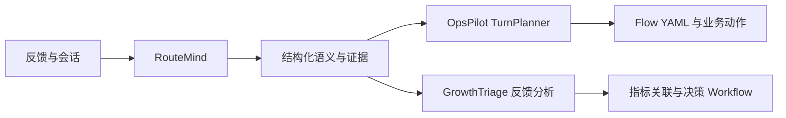

# RouteMind

基于 **Qwen3-32B + QLoRA** 的多语言用户反馈理解与证据抽取工程，为 OpsPilot 客服系统与 GrowthTriage 反馈分析提供结构化语义。

## 职责

- 理解英语、西语、葡语、印尼语、印地语、阿语及混合语言反馈。
- 联合输出多意图、条件/否定诉求、问题状态、槽位纠正、情绪、人工诉求和原文证据。
- 区分广告频次、广告打断、关闭困难、承诺差异、奖励未到账及付费后仍有广告。
- 使用同一份版本化 Pydantic/JSON Schema 贯通标注、训练、评估与 API。

模型不生成 Flow 节点或执行命令，不推断 Campaign/Creative 归属，不将用户陈述当作已核实事实。OpsPilot 的 TurnPlanner/Flow YAML 与 GrowthTriage 的 Workflow 继续负责规划和业务执行。



## 安装

Python 3.10–3.12。CPU 数据处理/API 契约测试不需要安装 PyTorch。

```bash
python -m venv .venv
# Linux / AutoDL
source .venv/bin/activate
# Windows PowerShell: .\.venv\Scripts\Activate.ps1
python -m pip install -e ".[test]"
python -m pytest -q
```

GPU 环境另行安装训练依赖，参见 [AutoDL 指南](docs/autodl.md)。所有命令从本仓库根目录运行。配置由环境变量显式传入，`.env.example` 仅列出变量，不会自动加载。

## 数据流程

```bash
python scripts/build_seeds.py
routemind validate data/seeds/feedback.jsonl
routemind split data/seeds/feedback.jsonl --output data/processed --seed 42
routemind format data/processed/train.jsonl --output outputs/train.messages.jsonl
routemind schema --output outputs/understanding.schema.json
```

仓库提供 66 条人工编写的**合成种子记录**，包含六种语言、混写及多轮用例。它们用于建立标注格式、开发数据管线和扩充语料，尚未经过母语标注审核；不是线上用户数据或独立效果测试集。实际训练前，按 [标注规范](docs/data-contract.md) 扩充并审核语料。

生成脚本仅在显式执行时调用外部模型，需要自己配置提供方、模型和密钥。请先小批量验证调用费用和输出质量。

```bash
# 预先设置 SYNTHESIS_API_KEY、SYNTHESIS_BASE_URL、SYNTHESIS_MODEL
routemind synthesize data/seeds/feedback.jsonl --output data/generated/batch01.jsonl --limit 6
routemind merge data/seeds/feedback.jsonl data/generated/batch01.jsonl --output data/generated/combined.jsonl
routemind split data/generated/combined.jsonl --output data/processed
```

同一来源场景及其翻译、改写共享 `scenario_group_id`，必须先合并再切分。切分检测 id、对话文本及场景跨集合泄漏，写入数据摘要 manifest；近义改写的语义去重仍需语料审核。`format` 是可读消息导出，训练命令直接读取原始标注格式。

## QLoRA 训练

```bash
routemind preflight --config configs/qwen3_32b.json
routemind tokenize-check --config configs/qwen3_32b.json
python scripts/autodl.py train --config configs/qwen3_32b.json
```

默认配置：Qwen3-32B、NF4 4-bit 双重量化、LoRA rank 16 / alpha 32、all-linear、梯度检查点、batch size 1、梯度累积 16。按 GPU 能力选择 BF16/FP16。v0.1 为单 GPU 训练脚本，显存是否充足需要在实际实例上验证。

训练和推理共用 Qwen3 非思考模板；仅 JSON 答案与 EOS 参与训练损失，prompt/padding 使用 `-100` 屏蔽。超长样本明确报错，不截掉目标 JSON。validation 用于训练期间评估，test 不参与优化。

默认要求训练及验证记录为 `approved`。`--allow-unreviewed` 仅用于明确接受未审核语料的管线实验，运行 manifest 会记录该选择；`rejected` 数据不能使用。CPU 检查可以执行：

```bash
python scripts/autodl.py check --allow-unreviewed
```

此命令不训练，不加载模型权重。训练完成时才会生成 `outputs/qwen3-32b/adapter/` 与 `run_manifest.json`。恢复训练使用 `--resume outputs/qwen3-32b/checkpoint-N`；不得将不同模型或数据的 checkpoint 混用。

## 独立评估

在具备 GPU 和模型权重的环境分别生成基线与 Adapter 预测：

```bash
routemind predict data/processed/test.jsonl --output outputs/base.predictions.jsonl
routemind predict data/processed/test.jsonl --adapter outputs/qwen3-32b/adapter --output outputs/tuned.predictions.jsonl
routemind evaluate data/processed/test.jsonl outputs/base.predictions.jsonl --output outputs/base.metrics.json
routemind evaluate data/processed/test.jsonl outputs/tuned.predictions.jsonl --output outputs/tuned.metrics.json
routemind compare outputs/base.metrics.json outputs/tuned.metrics.json
```

评估保存分语言指标、错误样本和原始生成，不自动修复 JSON。缺失预测、生成失败和非法输出保留在准确率/合规率分母中。指标定义见 [评估说明](docs/evaluation.md)。没有正样本的召回率返回 `null`，不伪装成 100%。

## 推理服务

安装训练依赖并准备基座及已训练 Adapter 后：

```bash
# Linux
export ROUTEMIND_MODEL=Qwen/Qwen3-32B
export ROUTEMIND_ADAPTER=outputs/qwen3-32b/adapter
routemind serve --host 127.0.0.1 --port 8020
```

不设置 `ROUTEMIND_ADAPTER` 时运行基座模型，可用于基线验证。加载失败时健康接口会返回 `ready: false`，推理返回 503；没有样本回放或规则回退。使用单 worker，避免重复加载权重。

- `GET /health`：存活、模型就绪状态及模型名称。
- `GET /schema`：输出 JSON Schema。
- `POST /v1/understand`：理解反馈。
- `GET /docs`：自动生成的 API 文档。

请求格式：

```json
{
  "request_id": "feedback-001",
  "messages": [
    {"id": "u1", "role": "user", "content": "I paid through Stripe, but Premium is still locked."}
  ]
}
```

响应包含 `request_id`、`model`、`adapter` 与 `result`。输出模型见 `src/routemind/schema.py`。HTTP 状态：422 输入错误、413 token 超限、429 并发忙、502 输出不符合契约、503 模型不可用/推理失败。单实例只允许一个推理任务，其余请求显式拒绝。客户端超时不会终止已开始的 GPU 运算。

默认仅绑定本机。若需跨机器调用，在受控网络/鉴权网关后部署；当前脚本不内置公网认证、多租户或跨进程请求队列。

## 消费方适配

两个适配脚本读取标准输入中的真实请求并调用服务：

```bash
python examples/opspilot.py < request.json
python examples/growthtriage.py < requests.json
```

OpsPilot 输出 `routemind_semantics` 和候选槽位，供 TurnPlanner 再结合现有状态规划。GrowthTriage 输出兼容标签与独立完整语义证据；不要把整个适配结果直接传入旧 `FeedbackOutput`。详见 [接入说明](docs/integration.md)。

## 工程验证范围

本次交付为 Python 工程，包含单元/契约测试、CPU 数据管线和训练环境预检；没有运行真实模型训练或 GPU 推理，没有发布 Adapter 或业务准确率结果。测试替身仅位于 `tests/`。训练依赖的实际 CUDA 组合、训练收敛及模型效果需在目标 GPU 环境确认。

本地 32 项测试及真实 tokenizer 模板检查已通过，详细环境与验证边界见 [工程验证记录](docs/verification.md)。

## 目录

```text
src/routemind/  Schema、数据、训练、推理、评估、API、客户端和适配
configs/       Qwen3-32B 训练配置
data/seeds/    合成种子标注
scripts/       种子构建与 AutoDL 入口
examples/      两个消费项目的 HTTP 接入脚本
tests/         数据、损失掩码、评估、API 和适配契约测试
docs/          标注、训练、评估和接入说明
```

实现参考了 [qlora-llm-fine-tuning](https://github.com/Debasish-87/qlora-llm-fine-tuning) 的任务方向，项目代码按 RouteMind 契约重新组织。来源说明见 [THIRD_PARTY_NOTICES.md](THIRD_PARTY_NOTICES.md)。
